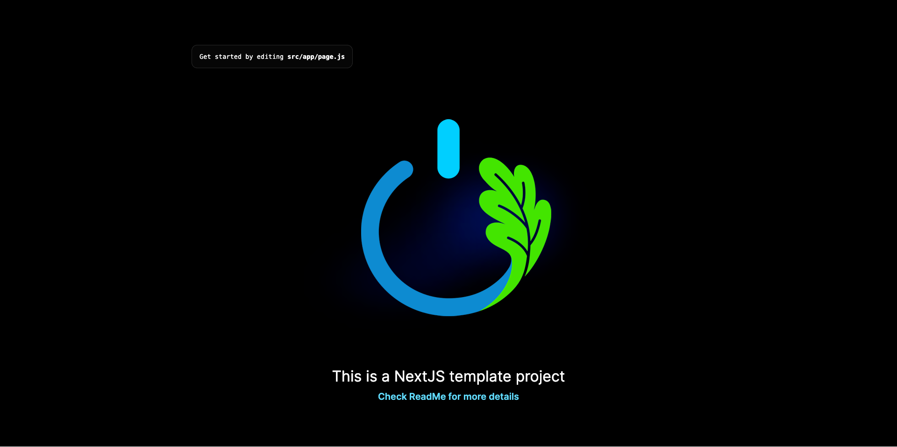

# Welcome to Oaks Solution and Studio NextJS Project Template

This project template has been carefully crafted to provide a standardized structure for NextJS projects developed by Oaks Solution and Studio. It follows a well-organized layout to enhance collaboration, code maintainability, and development efficiency.

## Project Structure

The project structure is designed to keep your codebase organized and easy to navigate:

- `public` folder: The public folder, where all the media or font files store.
  - `fonts` folder: The font files.
  - `images` folder: The image files.
  - `css` folder: The CSS files.
- `src` folder: The source folder
  - `app` folder: The main source code directory.
  - `components` folder: Reusable UI components.
    - `dialogs` folder: UI dialog components.
    - `widgets` folder: Widget components.
  - `configs` folder: Configuration files for the project.
  - `utilities` folder: Reusable utility functions.
  - `***/page.js` files: Page components.

## Getting Started

To use this project template for your new NextJS project:

1. Clone this repository.
2. Run `npm install` to install the dependencies.
3. Run `npm run dev` to start the development server.
4. Change `color-scheme` in globals.css to `dark` or `light` to switch between dark and light mode before you kickstart your project.
5. Customize the components, pages, and other elements based on your project requirements.
6. Run `npm run build` to build the static site for production.

## Contributing

We welcome contributions from the community! If you've found a bug, have suggestions, or want to add features, please open an issue or submit a pull request.

## License

This project is licensed under the [MIT License](LICENSE).

---

**Oaks Solution and Studio** - Creating Innovative Solutions Through Code
